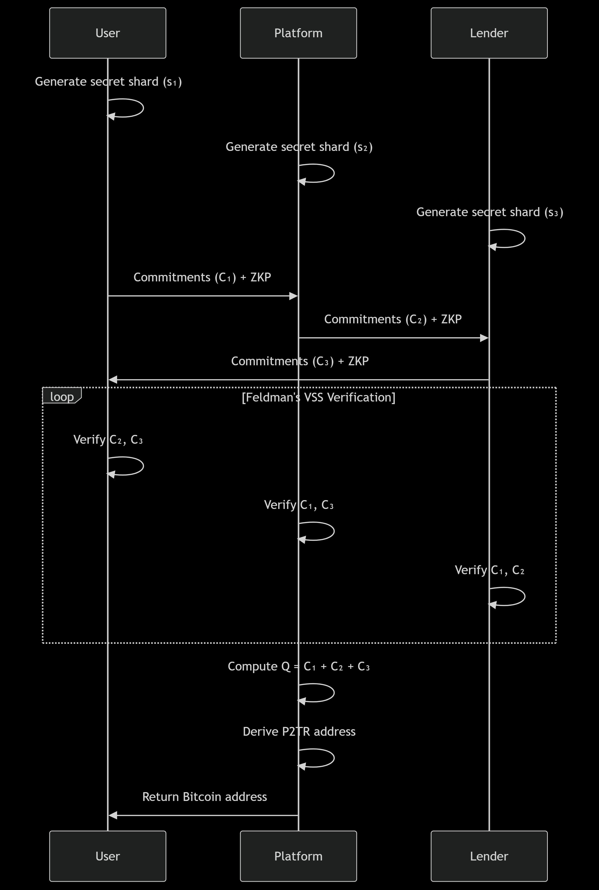

##  Project Structure

```bash
multi-party-dkg-system/
├── shared/                   # Shared utilities across all services
│   ├── crypto.js             # Cryptographic operations (shards, commitments, EC)
│   ├── zkp.js                # Zero-Knowledge Proof implementations
│   ├── network.js            # Secure communication utilities
│   └── constants.js          # Common constants (curve params, etc.)
├── user-service/             # User service
│   ├── src/
│   │   ├── controllers/
│   │   │   ├── keyController.js
│   │   │   └── walletController.js
│   │   ├── services/
│   │   │   ├── keyService.js
│   │   │   └── walletService.js
│   │   ├── utils/
│   │   │   ├── storage.js
│   │   │   └── validation.js
│   │   ├── routes/
│   │   │   ├── keyRoutes.js
│   │   │   └── walletRoutes.js
│   │   └── app.js
│   ├── config/
│   │   └── config.js
│   └── server.js
├── platform-service/         # Coordinator (Platform) service
│   ├── src/
│   │   ├── controllers/
│   │   │   ├── dkgController.js
│   │   │   └── verificationController.js
│   │   ├── services/
│   │   │   ├── keyService.js
│   │   │   ├── bitcoinService.js
│   │   │   └── validationService.js
│   │   ├── utils/
│   │   │   ├── bitcoin.js
│   │   │   └── vss.js
│   │   ├── routes/
│   │   │   ├── dkgRoutes.js
│   │   │   └── apiRoutes.js
│   │   └── app.js
│   ├── config/
│   │   └── config.js
│   └── server.js
├── lender-service/           # Lender service
│   ├── src/
│   │   ├── controllers/
│   │   │   ├── keyController.js
│   │   │   └── verificationController.js
│   │   ├── services/
│   │   │   ├── keyService.js
│   │   │   └── validationService.js
│   │   ├── utils/
│   │   │   ├── crypto.js
│   │   │   └── storage.js
│   │   ├── routes/
│   │   │   └── keyRoutes.js
│   │   └── app.js
│   ├── config/
│   │   └── config.js
│   └── server.js
├── docs/                     # Documentation
│   ├── API.md                # API specifications
│   └── CRYPTO.md             # Cryptographic protocols
└── docker-compose.yml        # Container orchestration


```


